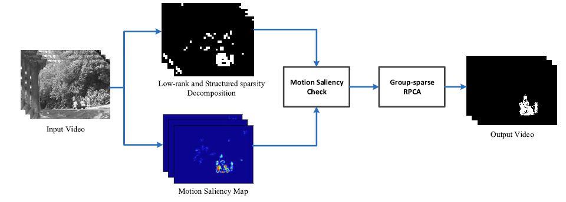

# LSD_Foreground_Detection
This contains source codes of TIP15 and ICME14 work

---

## Background Subtraction Based on Low-Rank and Structured Sparse Decomposition
By Xin Liu, Guoying Zhao, Jiawen Yao and Chun Qi , In *IEEE TIP*, *Vol. 24, 2502 - 2514, 2015*

LSD was initially presented in [ICME 2014](http://ieeexplore.ieee.org/document/6890200/).

  

### Contents
1. [Installation](#installation)
2. [Demo](#demo)
3. [Video](#video)
### Installation

- MATLAB
- SPAMS toolbox [[MATLAB Code]](http://spams-devel.gforge.inria.fr/downloads.html)
  - For the convenience, the version we used has already included in this package. Please unzip the zip file to get the toolbox.
  - Please follow the instruction to compile the SPAMS.

### Demo

Just simply run LSD_demo.m and images will be saved in /results.

### Video
 |  |  
:-------------------------:|:-------------------------:|:-------------------------:
Lobby with sudden light changes |  Curtain | Fall

If you find LSD useful in your research, please consider citing:

    @article{liu2015background,
      title={Background subtraction based on low-rank and structured sparse decomposition},
      author={Liu, Xin and Zhao, Guoying and Yao, Jiawen and Qi, Chun},
      journal={IEEE Transactions on Image Processing},
      volume={24},
      number={8},
      pages={2502--2514},
      year={2015},
      publisher={IEEE}
    }
    
    @inproceedings{yao2014foreground,
      title={Foreground detection using low rank and structured sparsity},
      author={Yao, Jiawen and Liu, Xin and Qi, Chun},
      booktitle={2014 IEEE International Conference on Multimedia and Expo},
      pages={1--6},
      year={2014},
      organization={IEEE}
    }

For any problems about our source code, please email Xin: linuxsino@gmail.com  or  Jiawen: yjiaweneecs@gmail.com 
